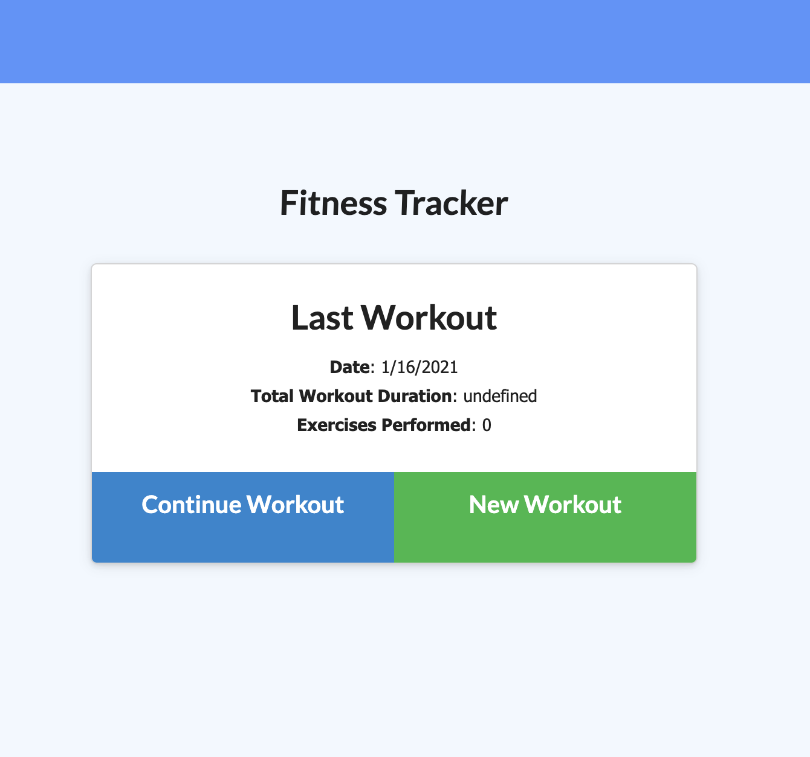
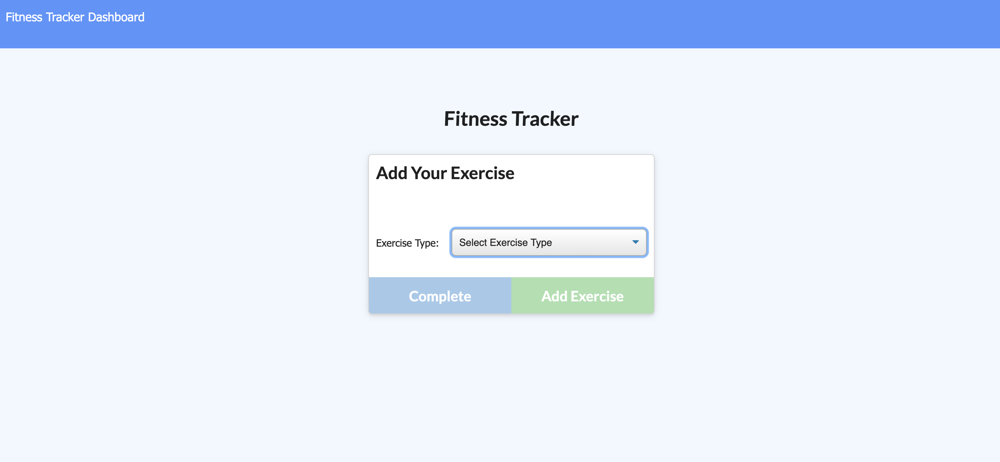
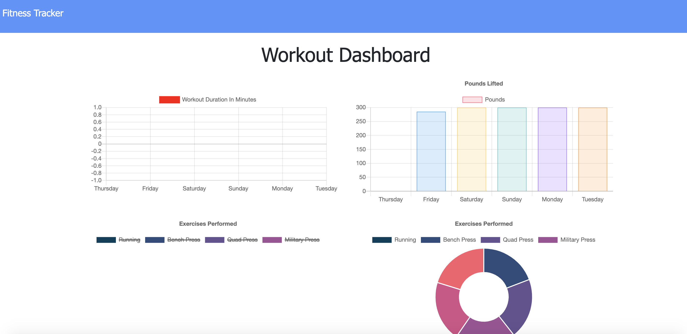

# fitnessTracker

## Table of Contents
  1. [Description](#description)
  2. [Image of product](#screenshots)
  3. [Usage](#usage)
  4. [Questions](#questions)
  
  
  
## Description 
This Fitness Tracker allows the user to create and keep track of new workouts, or continue previous ones.  When the user clicks 'new workout', they have the ability to select 'resistance' or 'cardio,' and will then be able to fill in the details of the workout and save it in a database powered by MongoDB.  If the user wants to see their stats for the last 7 days, they can click the 'dashboard' and see how they've been doing!

## Image of product 

## Usage 
To use, navigate to the app in your browser and click new workout!

You can find the app [here](https://drive.google.com/file/d/1EvBGva4CR6EjPJhpuVfuT9k55SW1yCVG/view).

## Questions 
If you have any questions, you may reach out to me at richardwalter515@gmail.com
or visit me on [GitHub](https://www.github.com/richardwalter515)